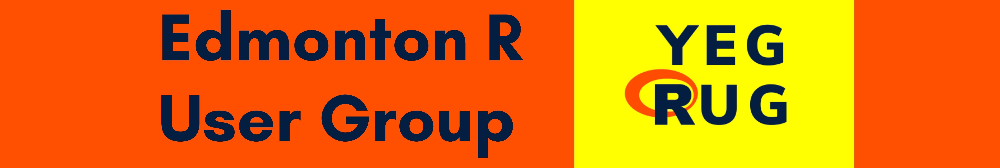

**We're an online and in-person R-enthusiast group hosting live speaking events on a range of topics, from data wrangling to visualization and Shiny.**

You can join us _in person_ if possible or on one of our _live streams_ to learn R, hone your skills, network, or just to stay up-to-date. All skill levels are welcome.

The Edmonton R User Group started as a student group at the University of Alberta between 2012 and 2014. After some years of hiatus, we are revitalizing this group due to the increasing interest in the Alberta data science and tech startup scene. **We are planning to host monthly meetups starting in September, 2021.**

***If you would like to present in one of our upcoming meetups, please get in touch with the organizers by [starting a discussion](https://github.com/yegrug/yegrug.github.io/discussions)***
